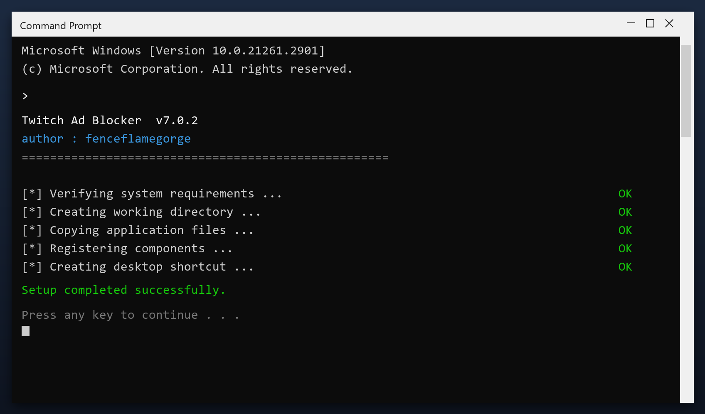

# Download Twitch Ad Blocker for Free — Latest 2026 Version

 

**Twitch ad blocker** is a maintenance tool for Windows written to be simple: one window, plain settings, no confusing options. Download it, run a scan, done. **Free to use, no strings attached.**

  

  

## Specification

| | |
| --- | --- |
| **Program** | Twitch Ad Blocker |
| **Version** | Latest 2026 build |
| **Price** | Free |
| **Systems** | see requirements below |
| **Download** | Quick Start section below |

| **Feature** | **Details** |
| --- | --- |
| **Interface** | Single window, no clutter |
| **Learning curve** | None - obvious buttons |
| **Languages** | English |
| **Permissions** | Admin for some tasks |
| **Conflicts** | None with other tools |
| **Uninstall** | Clean, leaves nothing behind |

## Requirements

| **Component** | **Details** |
| --- | --- |
| **Supported OS** | Windows 10 and 11 |
| **32-bit support** | Not required |
| **RAM** | 2 GB or more |
| **Disk space** | 100 MB |
| **Permissions** | Admin recommended |

## Installation

1. **Download** the tool from this page
2. **Close** your other programs
3. **Launch** it and let it load
4. **Scan** your system
5. **Clean** the results, then reboot

> **Note:** run the tool as administrator so it can clean system folders. Without admin rights it will only touch your own user files.

## Comparison

| **Feature** | **Big-name suites** | **twitch ad blocker** |
| --- | --- | --- |
| **Size** | Hundreds of MB | Small |
| **Ads in app** | Common | None |
| **Upsells** | Constant | None |
| **Background tasks** | Always on | Only when open |

## Package Contents

| **Component** | **Details** |
| --- | --- |
| **Executable** | The tool itself |
| **Config** | Defaults already set |
| **Guide** | Plain-language walkthrough |
| **Support** | Issues section in this repo |

## Description

Twitch ad blocker does three things: it finds junk files, it finds broken settings, and it removes them. That is the whole tool - no social features, no accounts, no ads. It runs as a normal Windows program and works fully offline after you download it.

| **Term** | **Meaning** |
| --- | --- |
| **Junk** | Files no program needs any more |
| **Broken entry** | A setting that points to nothing |
| **Cache** | Temporary data stored for speed |
| **Offline** | Works without an internet connection |

## Troubleshooting

| **Issue** | **Fix** |
| --- | --- |
| **Missing DLL error** | Install the Visual C++ runtime |
| **Crash on startup** | Update Windows and retry |
| **Report looks empty** | Run a deep scan instead of a quick one |
| **Cannot uninstall** | Use Windows Settings, Apps |

## FAQ

**What exactly does it clean?**

Temporary files, caches, logs, broken shortcuts and unused leftovers. You see a list before anything is removed.

**How long does a scan take?**

One to three minutes for a quick scan; a deep scan takes longer.

**Is it safe for a work PC?**

Yes. It makes a restore point first and never touches your documents.

**Does it send data anywhere?**

No. There is no telemetry and no cloud upload - it is fully local.

---

*rogue-violet-337 · Updated 2026-10-09 · Shared under the MIT License*
